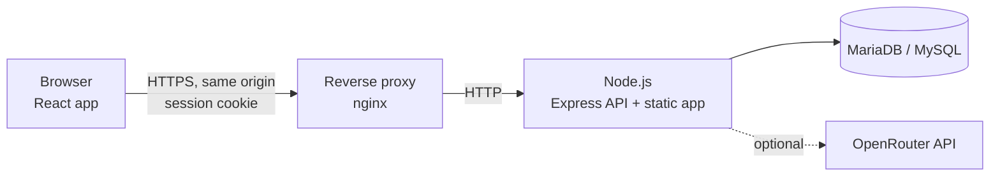

# Marketing Resource CRM

An internal CRM for marketing teams that manage many operational resources at once: SIM cards and phone numbers,
external agents, social media accounts, domains, ad campaigns, communication scripts and team reports — with
role-based access, a full audit trail and server-enforced permissions.

> **Security by design.** The system stores credential *references*, never secrets. No passwords, tokens, recovery
> codes or session cookies are kept in records, fixtures, exports, logs or browser storage. See [SECURITY.md](SECURITY.md).


---

## Contents

- [Features](#features)
- [Tech stack](#tech-stack)
- [Architecture](#architecture)
- [Getting started](#getting-started)
- [Configuration](#configuration)
- [Scripts](#scripts)
- [Project structure](#project-structure)
- [Testing](#testing)
- [Deployment](#deployment)
- [Documentation](#documentation)
- [Contributing](#contributing)
- [License](#license)

---

## Features

### Registers

| Module | Route | Highlights |
| --- | --- | --- |
| Dashboard | `/` | KPIs computed from the same records as the registers; every figure drills through to its rows |
| SIMs & Numbers | `/sims` | Duplicate detection across number formats, expiry tracking, bulk upload from a sheet template |
| Agents | `/agents` | External agents and agencies, manager edit lock, proof screenshots with verdict and payment, salary status, archive and restore |
| Social Accounts | `/accounts` | Accounts across Facebook, Instagram, TikTok, YouTube, X, Telegram, WhatsApp Business and configurable platforms |
| Domains | `/domains` | Registrar-export bulk upload, expiry highlighting, rotation tracking, archive tab |
| Reserve Inventory | `/reserves` | Ready-to-assign accounts with published readiness criteria |

### Operations

| Module | Route | Highlights |
| --- | --- | --- |
| Growth | `/growth` | Dated daily follower totals and short-form content engagement — manually entered, never implied to be live |
| Ads Monitoring | `/ads-monitoring` | Campaigns, exact multi-currency money, daily metrics, trends, creatives, Excel import, creator-only edits |
| Shared Spiel Library | `/shared-spiel` | Communication scripts with approval workflow, versioning, reference documents and an AI writing assistant |
| Team Reports | `/team-reports` | Daily, weekly and monthly reports with attachments and administrator replies |
| Assignments | `/assignments` | Allocations and handovers with conflict prevention |
| Credential Refs | `/credentials` | Vault pointers only, clearly labelled as not connected |
| Brands & Team | `/brands` | Brands, projects, platforms, users and invitations |

### Data and administration

| Module | Route | Highlights |
| --- | --- | --- |
| Reports | `/reports` | Inventory, allocation, readiness, renewals, follow-ups, data quality |
| Import | `/import` | CSV import with mapping, validation and a preview before anything is saved |
| Roles & Audit | `/audit` | Editable role and per-person permissions, full audit history |

### Across the whole app

- **Global toolbar** on every page: refresh, search, filter, clear filters, saved views, export to CSV / Excel / PDF,
  print, copy link, share, full screen, notifications, help, profile and keyboard shortcuts.
- **Role-based access control** decided on the server: System Administrator, Marketing Manager, Marketing Staff and
  Read-only Reviewer, with permissions editable per role and per person.
- **Audit trail** recording actor, time, record, action, reason and safe field changes — sensitive values are redacted.
- **Privacy defaults:** contact details masked until revealed; exports mask them unless deliberately included.
- **Destructive actions** prefer archiving and require a written reason.
- **AI Assistant Learner** (optional) via OpenRouter, server-side only, with model fallback, redaction of phone numbers
  and emails, per-member limits and private suggestion history.
- **Accessible, responsive UI** with light and dark themes, keyboard navigation and a collapsible sidebar.

## Tech stack

| Layer | Technology |
| --- | --- |
| Frontend | React 19, TypeScript (strict), Vite 8, Tailwind CSS v4, Radix UI primitives |
| Data & forms | TanStack Query, TanStack Table, React Hook Form, Zod |
| Charts & files | Chart.js, read-excel-file / write-excel-file, fflate |
| Backend | Node.js (≥ 20.19), Express 5, mysql2, Argon2 password hashing, server-side sessions |
| Database | MariaDB 10.11+ or MySQL 8 |
| AI (optional) | OpenRouter chat completions, called from the server only |
| Quality | Vitest, Testing Library, MSW, oxlint |

## Architecture



- **One process, one origin.** In production the Node server serves both the built app and `/api`, so the session
  cookie never has to be cross-site.
- **Shared rules.** Business rules live in `src/lib/` as pure functions used by the browser, the server and the tests,
  so a permission or validation rule is written once.
- **Server-side authorization.** Every route re-checks the session and permissions. Hidden or disabled buttons in the
  interface are a convenience, never the control.
- **Files in the database.** Uploads are validated by type, content and size, stored in chunks, and only served
  through authorised routes with a locked-down content security policy.

The full design is documented in [DEVELOPER-HANDOVER.md](DEVELOPER-HANDOVER.md).

## Getting started

### Prerequisites

- Node.js **20.19 or newer** (22 LTS recommended)
- MariaDB 10.11+ or MySQL 8 with an empty database and a user that can create tables

### Try it without a database

The app ships with an in-browser mock API for a quick look. Nothing you enter is saved.

```bash
npm install
VITE_USE_MOCK_API=true npm run dev
```

Open <http://localhost:5173>. Modules that need the real server (Ads Monitoring, Shared Spiel Library) explain that
they are unavailable in the preview.

### Run it for real

```bash
npm install
npm run setup:env        # creates .env interactively; the database password is typed without echo
npm run db:check         # read-only: confirms which database you are connected to
npm run db:migrate       # creates the schema; safe to re-run
npm run db:seed-config   # loads countries and platforms
npm run seed:users       # creates accounts and one-time invite links (see SETUP.md)
```

Then, in two terminals:

```bash
npm run server           # API on http://localhost:3001
npm run dev              # app on http://localhost:5173 (proxies /api to the API)
```

Open the invite link written to `invites.local.txt`, set your password, and sign in. The workspace starts empty.
Step-by-step instructions and troubleshooting are in [SETUP.md](SETUP.md).

## Configuration

Configuration is read from `.env` (never committed). `npm run setup:env` writes it for you; `.env.example` lists every key.

| Variable | Required | Description |
| --- | :---: | --- |
| `DB_HOST`, `DB_PORT`, `DB_NAME`, `DB_USER`, `DB_PASSWORD` | ✅ | Database connection |
| `SESSION_SECRET` | ✅ | At least 32 random characters; generated by `setup:env` |
| `APP_ORIGIN` | | Public address of the app, used for cookies and invite links (default `http://localhost:5173`) |
| `NODE_ENV` | | `development`, `test` or `production` |
| `PORT` / `HOST` | | Where the API listens (default `3001` on `127.0.0.1`) |
| `TRUST_PROXY` | | Number of reverse proxies in front of the app (`1` for nginx, `2` for a CDN plus nginx) |
| `SESSION_TTL_HOURS` / `INVITE_TTL_HOURS` | | Session idle lifetime (12) and invite validity (72) |
| `COOKIE_SECURE` | | Force the Secure cookie flag; defaults to on in production |
| `OPENROUTER_API_KEY` | | Enables the AI Assistant Learner. Leave unset to disable it |

The server validates configuration at startup and exits naming any missing or malformed key — never its value.

## Scripts

| Command | Purpose |
| --- | --- |
| `npm run dev` | Start the Vite dev server |
| `npm run server` | Start the API with file watching |
| `npm run server:start` | Start the API (production) |
| `npm run build` | Type-check and build the browser app |
| `npm run typecheck` / `npm run typecheck:server` | Type-check the app / the server |
| `npm run lint` | Lint with oxlint |
| `npm test` | Run the unit, component and API contract tests |
| `npm run setup:env` | Create `.env` interactively |
| `npm run db:check` | Show which database the configuration reaches (read-only) |
| `npm run db:migrate` | Apply pending migrations |
| `npm run db:seed-config` | Sync countries and platforms |
| `npm run db:export-sql` | Export the schema as one SQL file for panel-based imports |
| `npm run seed:users` | Create team accounts and invite links |
| `npm run deploy:bundle` | Build a production archive for upload to a server |

## Project structure

```
.
├── server/                 Express API
│   ├── ai/                 OpenRouter client, document text extraction
│   ├── auth/               Sessions, credentials, permission middleware
│   ├── db/                 Pool, id allocation, migration runner, migrations/*.sql
│   ├── repositories/       Column maps, row mappers, bootstrap payload
│   ├── routes/             One module per area (agents, domains, ads/, spiels/, …)
│   └── scripts/            Setup, seeding and export scripts
├── src/                    React app
│   ├── components/         UI primitives, shared controls, layout (shell, toolbar)
│   ├── features/           Feature-specific dialogs, panels and hooks
│   ├── hooks/              Data, session, auth, theme, URL filters
│   ├── lib/                Shared business rules used by browser and server
│   ├── mocks/              MSW mock API and synthetic fixtures (tests and preview)
│   └── routes/             One file per page
├── scripts/                Build tooling (deploy bundle)
├── DEVELOPER-HANDOVER.md   Architecture and design decisions
├── SETUP.md                First-time setup
└── DEPLOY.md               Production deployment
```

## Testing

```bash
npm test                 # unit, component (jsdom) and API contract tests
npm run typecheck && npm run typecheck:server
npm run lint
```

The default suite needs no database. Real-database integration tests (Ads Monitoring, permissions, proofs, Shared
Spiel Library) are skipped unless explicitly enabled, and they **delete data** — run them only against a throwaway
database:

```bash
npm run db:migrate && npm run db:seed-config    # against the scratch database
ADS_IT=1 ADS_IT_CONFIRM_DB=<scratch-db-name> npx vitest run --no-file-parallelism server/routes
```

`ADS_IT_CONFIRM_DB` must repeat `DB_NAME`, a guard against running them with a live configuration loaded.

## Deployment

The production shape is a single Node process behind a TLS-terminating reverse proxy:

```bash
npm run deploy:bundle    # builds and packs deploy/marketingcrm-<timestamp>.tar.gz
```

The bundle excludes `.env`, `node_modules`, tests and the mock API, and is verified after it is written. On the
server: extract, `npm ci --omit=dev`, `npm run db:migrate`, then (re)start the process. The full guide — Node, nginx,
process management, TLS, a CDN in front, and upgrades — is in [DEPLOY.md](DEPLOY.md).

## Documentation

| Document | For |
| --- | --- |
| [SETUP.md](SETUP.md) | Setting up a database and running locally |
| [DEPLOY.md](DEPLOY.md) | Deploying to a Linux server |
| [DEVELOPER-HANDOVER.md](DEVELOPER-HANDOVER.md) | Architecture, API, authorization, module designs, known gaps |
| [CONTRIBUTING.md](CONTRIBUTING.md) | Development workflow and pull request checklist |
| [SECURITY.md](SECURITY.md) | Security model and how to report a vulnerability |
| [CHANGELOG.md](CHANGELOG.md) | Notable changes |

## Contributing

Contributions are welcome. Please read [CONTRIBUTING.md](CONTRIBUTING.md) first — in particular the rules on
migrations, server-side authorization and never committing secrets or personal data.

## License

No license has been chosen for this project yet. Until a `LICENSE` file is added, all rights are reserved by the
copyright holder: you may view the code, but copying, modifying or redistributing it requires permission.
